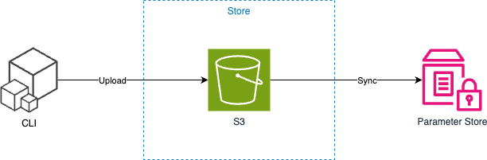

# Go Download Env Tool

## At First...

1. Create S3 Bucket
2. Assign AWS Profile, Role

## Functions

- [x] settings s3 store (project.yaml)
- [ ] insert s3 -> ssm parameter store
- [ ] sync s3 -> ssm parameter
